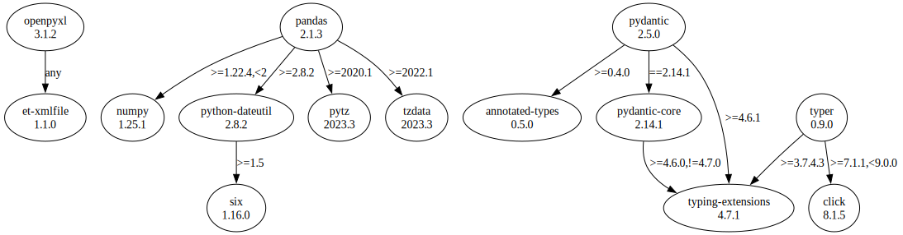

# Third Party Dependencies

<!--[[[fill sbom_sha256()]]]-->
The [SBOM in CycloneDX v1.4 JSON format](https://git.sr.ht/~sthagen/hyperkuutio/blob/default/sbom/cdx.json) with SHA256 checksum ([3cf6ac57 ...](https://git.sr.ht/~sthagen/hyperkuutio/blob/default/sbom/cdx.json.sha256 "sha256:3cf6ac57b556917e38a24e43101665a51bd01c5f806e1956a5c87b0b4d131bbf")).
<!--[[[end]]] (checksum: 2ff95238d9e736b6435c626544b89dbe)-->
## Licenses

JSON files with complete license info of: [direct dependencies](direct-dependency-licenses.json) | [all dependencies](all-dependency-licenses.json)

### Direct Dependencies

<!--[[[fill direct_dependencies_table()]]]-->
| Name                                             | Version                                             | License     | Author                                              | Description (from packaging data)                                       |
|:-------------------------------------------------|:----------------------------------------------------|:------------|:----------------------------------------------------|:------------------------------------------------------------------------|
| [openpyxl](https://openpyxl.readthedocs.io)      | [3.1.2](https://pypi.org/project/openpyxl/3.1.2/)   | MIT License | See AUTHORS                                         | A Python library to read/write Excel 2010 xlsx/xlsm files               |
| [pandas](https://pandas.pydata.org)              | [2.0.3](https://pypi.org/project/pandas/2.0.3/)     | BSD License | The Pandas Development Team <pandas-dev@python.org> | Powerful data structures for data analysis, time series, and statistics |
| [pydantic](https://github.com/pydantic/pydantic) | [1.10.9](https://pypi.org/project/pydantic/1.10.9/) | MIT License | Samuel Colvin                                       | Data validation and settings management using python type hints         |
| [typer](https://github.com/tiangolo/typer)       | [0.9.0](https://pypi.org/project/typer/0.9.0/)      | MIT License | Sebastián Ramírez                                   | Typer, build great CLIs. Easy to code. Based on Python type hints.      |
<!--[[[end]]] (checksum: 73ab5948665511b6ec685b8b7e382931)-->

### Indirect Dependencies

<!--[[[fill indirect_dependencies_table()]]]-->
| Name                                                             | Version                                                    | License                              | Author                                                                                | Description (from packaging data)                          |
|:-----------------------------------------------------------------|:-----------------------------------------------------------|:-------------------------------------|:--------------------------------------------------------------------------------------|:-----------------------------------------------------------|
| [click](https://palletsprojects.com/p/click/)                    | [8.1.3](https://pypi.org/project/click/8.1.3/)             | BSD License                          | Armin Ronacher                                                                        | Composable command line interface toolkit                  |
| [et-xmlfile](https://foss.heptapod.net/openpyxl/et_xmlfile)      | [1.1.0](https://pypi.org/project/et-xmlfile/1.1.0/)        | MIT License                          | See ATUHORS.txt                                                                       | An implementation of lxml.xmlfile for the standard library |
| [numpy](https://www.numpy.org)                                   | [1.24.0](https://pypi.org/project/numpy/1.24.0/)           | BSD License                          | Travis E. Oliphant et al.                                                             | Fundamental package for array computing in Python          |
| [python-dateutil](https://github.com/dateutil/dateutil)          | [2.8.2](https://pypi.org/project/python-dateutil/2.8.2/)   | Apache Software License; BSD License | Gustavo Niemeyer                                                                      | Extensions to the standard Python datetime module          |
| [pytz](http://pythonhosted.org/pytz)                             | [2022.7](https://pypi.org/project/pytz/2022.7/)            | MIT License                          | Stuart Bishop                                                                         | World timezone definitions, modern and historical          |
| [six](https://github.com/benjaminp/six)                          | [1.16.0](https://pypi.org/project/six/1.16.0/)             | MIT License                          | Benjamin Peterson                                                                     | Python 2 and 3 compatibility utilities                     |
| [typing_extensions](https://github.com/python/typing_extensions) | [4.4.0](https://pypi.org/project/typing_extensions/4.4.0/) | Python Software Foundation License   | "Guido van Rossum, Jukka Lehtosalo, Łukasz Langa, Michael Lee" <levkivskyi@gmail.com> | Backported and Experimental Type Hints for Python 3.7+     |
<!--[[[end]]] (checksum: 71f3db1a92b99de94788828ea664bee5)-->

## Dependency Tree(s)

JSON file with the complete package dependency tree info of: [the full dependency tree](package-dependency-tree.json)

### Rendered SVG

Base graphviz file in dot format: [Trees of the direct dependencies](package-dependency-tree.dot.txt)



### Console Representation

<!--[[[fill dependency_tree_console_text()]]]-->
````console
openpyxl==3.1.2
└── et-xmlfile [required: Any, installed: 1.1.0]
pandas==2.0.3
├── numpy [required: >=1.21.0, installed: 1.24.0]
├── python-dateutil [required: >=2.8.2, installed: 2.8.2]
│   └── six [required: >=1.5, installed: 1.16.0]
├── pytz [required: >=2020.1, installed: 2022.7]
└── tzdata [required: >=2022.1, installed: 2023.3]
pydantic==1.10.9
└── typing-extensions [required: >=4.2.0, installed: 4.4.0]
typer==0.9.0
├── click [required: >=7.1.1,<9.0.0, installed: 8.1.3]
└── typing-extensions [required: >=3.7.4.3, installed: 4.4.0]
````
<!--[[[end]]] (checksum: 90336fb06d1639ad42cae4a0e25ae349)-->
